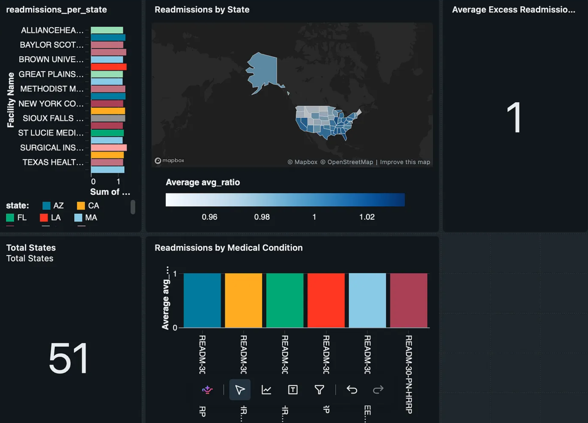
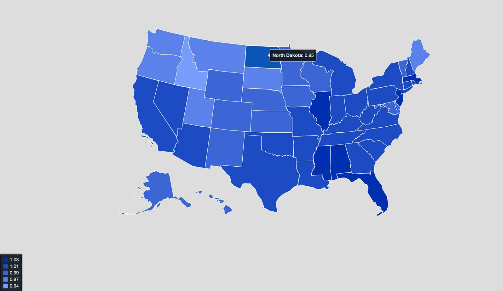
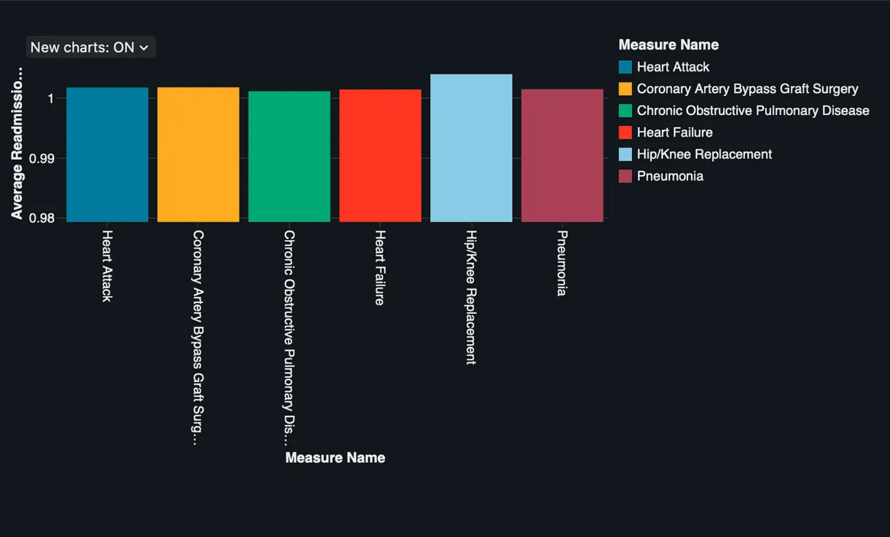
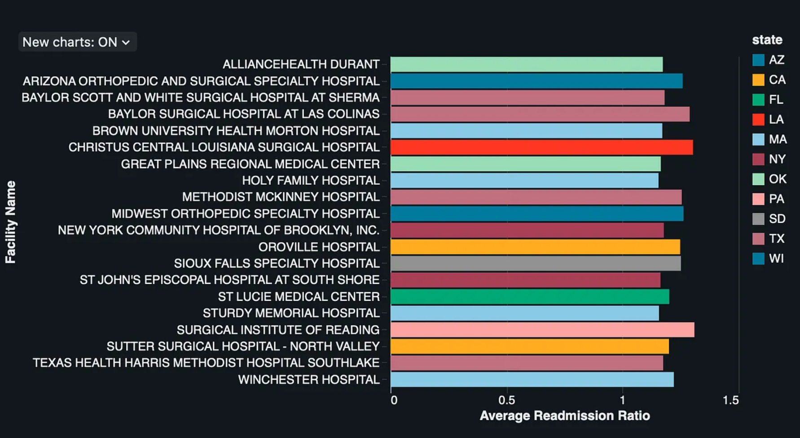

# 🏥 Healthcare Readmissions Analytics Dashboard

An end-to-end healthcare analytics project built using **Databricks SQL**. This project demonstrates the complete analytics workflow, from cleaning real-world healthcare data to designing an interactive dashboard that highlights hospital readmission trends across the United States.

---

## 📊 Dashboard Preview

---

# 📌 Project Overview

Hospital readmissions are an important indicator of healthcare quality. High readmission rates may suggest issues with patient care, discharge planning, follow-up treatment, or access to healthcare services.

For this project, I used **Databricks SQL** to analyse the **CMS Hospital Readmissions and Deaths** dataset and build an interactive dashboard that helps answer important healthcare questions.

The dashboard was designed to answer three key questions:

- 🌍 Which states have the highest readmission burden?
- 🩺 Which medical conditions contribute most to readmissions?
- 🏥 Which hospitals stand out as potential outliers?

---

# 📈 Dashboard Analysis

The dashboard was designed around three key analytical questions: where readmissions are occurring, which conditions contribute most to readmission rates, and which hospitals may require further investigation.

---

## 🌍 Geographic Analysis

The state-level map visualises the average **Excess Readmission Ratio** across the United States. This helps identify geographic patterns and areas where readmission performance may differ.

---

## 🩺 Condition Analysis

This chart highlights the medical conditions associated with the highest average Excess Readmission Ratios, helping identify conditions that may require targeted improvement efforts.

---

## 🏥 Hospital Rankings

The hospital ranking visualisation highlights hospitals with higher Excess Readmission Ratios, helping identify potential outliers for further investigation.

